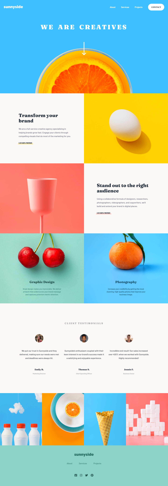
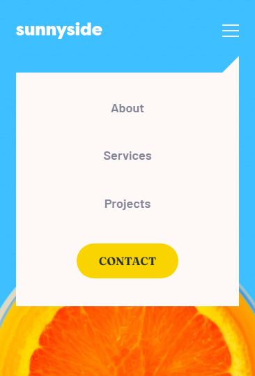

# Frontend Mentor - Sunnyside agency landing page solution

This is a solution to the [Sunnyside agency landing page challenge on Frontend Mentor](https://www.frontendmentor.io/challenges/sunnyside-agency-landing-page-7yVs3B6ef). Frontend Mentor challenges help you improve your coding skills by building realistic projects.

## Table of contents

- [Overview](#overview)
  - [The challenge](#the-challenge)
  - [Screenshot](#screenshot)
  - [Links](#links)
- [My process](#my-process)
  - [Built with](#built-with)
  - [What I learned](#what-i-learned)
  - [Continued development](#continued-development)
  - [Useful resources](#useful-resources)
- [Author](#author)

## Overview

### The challenge

Users should be able to:

- View the optimal layout for the site depending on their device's screen size
- See hover states for all interactive elements on the page

### Screenshot



### Links

- HTML Solution URL: [HTML](https://github.com/JustANipple/sunnyside-agency-landing-page/blob/master/index.html)
- SCSS Solution URL: [SCSS](https://github.com/JustANipple/sunnyside-agency-landing-page/blob/master/styles/main.scss)
- JS Solution URL: [JS](https://github.com/JustANipple/sunnyside-agency-landing-page/blob/master/scripts/script.js)
- Live Site URL: [LIVE](https://justanipple.github.io/sunnyside-agency-landing-page/)

## My process

### Built with

- Semantic HTML5 markup
- CSS custom properties
- Flexbox
- CSS Grid
- Mobile-first workflow
- SCSS
- JS

### What I learned

Splitting code into different components was a good idea to keep everything organized and clear to what it refers to, thanks to their names:

```scss
/* ====== Reset ====== */
@use "scss/base/reset";
/* ====== Variables ====== */
@use "scss/abstracts/variables";
/* ====== Components ====== */
@use "scss/components/header";
@use "scss/components/nav";
@use "scss/components/features";
@use "scss/components/testimonials";
@use "scss/components/picturesGrid";
@use "scss/components/footer";
@use "scss/components/scrollbar";
```

The dropdown menu for the mobile view was a challenge too, but i learned to make it functional and responsive:



While i wanted to make the site as beautiful as possible, i styled a bit the scrollbar using webkit pseudo element

```scss
::-webkit-scrollbar {
    width: .5rem;
}

// block containing the bar
::-webkit-scrollbar-track {
    background-color: v.$almost-white;
}

// bar
::-webkit-scrollbar-thumb {
    background-color: v.$yellow;
}

// bar on hover
::-webkit-scrollbar-thumb:hover {
    background-color: v.$soft-red;
    transition: background-color .5s ease-in-out;
}
```

### Continued development

to organize the code and make it as reusable as possible, i tried to introduce a BEM naming convention, but it's still rough and i want to work on it more to make it more clear

### Useful resources

- [Custom scrollbar](https://www.w3schools.com/howto/howto_css_custom_scrollbar.asp) - With this i learned to create a custom scrollbar for the challenge
- [Change logo color](https://codepen.io/jumarjuaton/full/mdJYWYq) - This is a filter generator that takes a color as input. It helped getting the footer logo the same color as the design

## Author

- Frontend Mentor - [@JustANipple](https://www.frontendmentor.io/profile/JustANipple)
